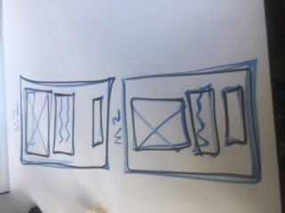
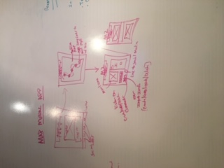
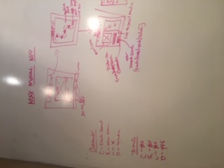
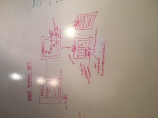

<!-- Link to trello Board -->
https://trello.com/b/Cm0j6I8u/project-3

<!-- Link to Heroku  -->
https://fathomless-brook-49672.herokuapp.com/

##Wireframe

##Whiteboard

Project-: Building a full-stack Application

Technologies Used
Languages - React, MongoDB, Mongoose, Express, Node JS, Javascript, HTML5 & CSS3
Text Editor - Visual Studio Code v.1.33.0
User Stories, Project Planning & Progress Tracking via Trello
Deployed using Heroku

Vision for APP
The goal was to build an app that allowed users/ tourists to pinpoint where and what public murals were along the beltline trail. A user would have access to an interactive map that held clickable and hoverable icons of each artist in the exact position on the trail of where the mural or work of art existed. A user would have the option of submitting updated information in case a new artist and mural existed.
